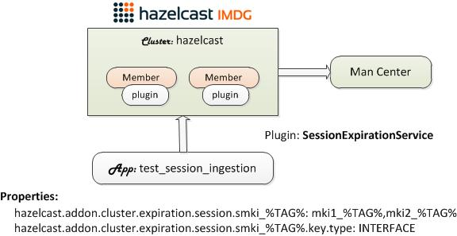

# Session Expiration Management Plugin

This bundle provides a plugin that expires session objects in a given map and their relevant entries in other Hazelcast maps.

## Installing Bundle

```bash
install_bundle -download bundle-hazelcast-4n5-app-perf_test_session-cluster-session
```

## Use Case

You are storing user session objects in multiple Hazelcast maps. A single user session touches one or more maps and when the user is idle for some time, you want to end the session and remove all the entries that belong to that particular session from all the relevant maps. To achieve this, you decide to embed the session ID (typically UUID) as a part of all the keys that you are storing in the maps. You also configure the maps with `max-idle-seconds`, but since each map times out individually, the session entries would expire undeterministically, i.e., some entries may expire earlier than others if there were no activities. Your task is to deterministcally expire all the entries from the relevant maps at the same time when the session times out.



## `SessionExpirationService` Plugin

The provided `SessionExpirationService` plugin solves this use case by adding an `EntryExpiredListener` to the primary map that gets updated for all session activities. If an entry expires in the primary map, then the listener also expires (or removes) that session's entries from all the relevant maps. To lighten the load on the cluster, `SessionExpirationService` spawns a thread with a blocking queue that takes on the removal tasks.

## Installation Steps

Run the `session` cluster's `build_app` script which sets the correct Hazelcast XML schema version in the `etc/hazelcast.xml` file. This step is not necessary if your workspace is running Hazelcast 4.x.

```bash
switch_cluster session/bin_sh
./build_app
```

## Startup Sequence

1. Start the `session` cluster.

```bash
switch_cluster session

# Add two (2) or more members in the cluster
add_member; add_member

# Start the session cluster and management center
start_cluster -all
```

2. Ingest data. The following maps have been preconfigured to timeout in 5 seconds. See [hazelcast.yaml](clusters/session/etc/hazelcast.yaml).

| PrimaryMap | Relevant Maps         | KeyType         |
| ---------- | --------------------- | --------------- |
| smki_%TAG% | mki1_%TAG%,mki2_%TAG% | INTERFACE       |
| smko_%TAG% | mko1_%TAG%,mko2_%TAG% | OBJECT          |
| smkc_%TAG% | mkc1_%TAG%,mkc2_%TAG% | CUSTOM          |
| smkp_%TAG% | mkp1_%TAG%,mkp2_%TAG% | PARTITION_AWARE |
| smks_%TAG% | mks1_%TAG%,mks2_%TAG% | STRING          |
| mkp_session_web_session_fi_session_id_mapping_%TAG% | mkp_session_fi_session_data_%TAG%,mkp_session_application_data_%TAG% | OBJET           |

```bash
cd_cluster session/bin_sh

# Print usage
./test_session_ingestion -?

# INTERFACE: Ingest InterfaceKey that implements ISessionId into
#            smki_EN01, mki1_EN01, mki2_EN02
./test_session_ingestion -type INTERFACE -primary smki_EN01 -relevant mki1_EN01,mki2_EN01

# OBJECT: Ingest objects (ObjectKey) with the getSessionId() method into
#         smko_EN01, mko1_EN01, mko2_EN02
# The key property, sessionId, is specified in the cluster config file.
./test_session_ingestion -type OBJECT -primary smko_EN01 -relevant mko1_EN01,mko2_EN01

# CUSTOM: Ingest CustomKey objects into
#         smkc_EN01, mkc_EN01, mkc2_EN02
# SessionID is extracted by CustomPredicate specified in the cluster config file.
./test_session_ingestion -type CUSTOM -primary smkc_EN01 -relevant mkc1_EN01,mkc2_EN01

# PARTITION_AWARE: Ingest PartitionAwareKey that implements PartitionAware into
#        smkp_EN01, mkp1_EN01, mkp2_EN02
#        It uses PartitionAware.getPartionKey() as the session ID.
./test_session_ingestion -type PARTITION_AWARE -primary smkp_EN01 -relevant mkp1_EN01,mkp2_EN01

# STRING: Ingest String keys into
#         smks_EN01, mks_EN01, mks2_EN02
# SessionID is extracted from key objects using the specified delimiter in the cluster
# config file. The default delimiter is '@' and the session ID is the last part of the key.
./test_session_ingestion -type STRING -primary smks_EN01 -relevant mks1_EN01,mks2_EN01

# OBJECT: Ingest objects (ObjectKey) with the getSessionId() method into 
#         mkp_session_web_session_fi_session_id_mapping_EN0, 
#         mmkp_session_fi_session_data_EN01, 
#         mkp_session_application_data_EN0
# The key property, sessionId, is specified in the cluster config file.
./test_session_ingestion -type OBJECT -primary mkp_session_web_session_fi_session_id_mapping_EN01 -relevant mkp_session_fi_session_data_EN01,mkp_session_application_data_EN01
```

3. Monitor the maps from the management center.

URL: http://localhost:8080/hazelcast-mancenter

## Configuring `SessionExpirationService`

There are three (3) distinctive settings that must be included in the Hazelcast configuration file as follows.

1. Properties for defining the primary map, relevant maps, and session key delimiter.
2. `org.hazelcast.addon.cluster.expiration.SessionExpirationServiceInitializer` for initializing and starting the `SessionExpirationService` plugin.
3. `org.hazelcast.addon.cluster.expiration.SessionExpirationListener` for each primary map configured with `max-idle-seconds` or `time-to-live-seconds`.

| Property | Description | Default |
| -------- | ----------- | ------- |
| hazelcast.addon.cluster.expiration.tag | Tag used as a prefix to each log message and a part of JMX object name. | SessionExpirationService |
| hazelcast.addon.cluster.expiration.jmx-use-hazelcast-object-name | If true, then the standard Hazelcast JMX object name is registered for the session expiration service. Hazelcast metrics are registered with the header “com.hazelcast” and “type=Metrics”. If false or unspecified, then object name is registered with the header “org.hazelcast.addon” and “type=SessionExpirationService”. | false |
| hazelcast.addon.cluster.expiration.key.delimiter | Delimiter that separates key string and the sessionID. The sessionID is always at the tail end of the string value. | @ |
| hazelcast.addon.cluster.expiration.session. | Property prefix for specifying a session map and the relevant maps. | N/A |
| hazelcast.addon.cluster.expiration.session.foo%TAG%yong | Primary map name that begins with "foo" and ends with "yong" with the pattern matcher %TAG% in between. This property's value must be a comma separated list of relevant map names with zero or more %TAG% and optional regex. See examples below. | N/A |
| hazelcast.addon.cluster.expiration.session.foo%TAG%yong.key.type | Key type. Valid types are CUSTOM, INTERFACE, OBJECT, PARTITION_AWARE, and STRING. | STRING |
| hazelcast.addon.cluster.expiration.session.foo%TAG%yong.key.property | Key property. The key class' "get" method that returns the session ID. | N/A |
| hazelcast.addon.cluster.expiration.session.foo%TAG%yong.key.predicate | Predicate class name. Applies to the CUSTOM key type only. | N/A |

:pencil2: **%TAG%** is a special replacement annotation that makes an exact match of its position in the string value.  Regular expression is supported for listing relevant map names.

**Example 1:**

```yaml
hazelcast.addon.cluster.expiration.session.foo%TAG%yong: abc_%TAG%,xyz_%TAG%,mymap
```

The above example matches the following map names.

| Primary Map | Relevant Maps |
| ----------- | ------------- |
| fooEN01yong | abc_EN01, xyz_EN01, mymap |
| fooEN02yong | abc_EN02, xyz_EN02, mymap |

**Example 2 (regex):**

```yaml
hazelcast.addon.cluster.expiration.session.foo%TAG%yong: abc_%TAG%_.*_xyz
```

The above example matches the following map names.

| Primary Map | Relevant Maps |
| ----------- | ------------- |
| fooEN01yong | abc_EN01_a_xyz, abc_EN01_ab_xyz, abc_EN01_aaaa_xyz |
| foo_EN02_yong | abc__EN02__a_xyz, abc__EN02__ab_xyz, abc__EN02__aaaa_xyz |

Use the following configuration files as references. Note that there are two (2) sets of OBJECT maps: `smko_*` and `mkp_session_web_session_fi_session_id_mapping_*`. The relevant maps of the latter have been configured with an index to provide better performance.

- [hazelcast.yaml](clusters/session/etc/hazelcast.yaml)

```yaml
hazelcast:
  ...
  properties:
    hazelcast.phone.home.enabled: false
    hazelcast.addon.cluster.expiration.tag: SessionExpirationService
    hazelcast.addon.cluster.expiration.key.delimiter: "@"

    # INTERFACE expects key classes to implement the ISessionId interface.
    hazelcast.addon.cluster.expiration.session.smki_%TAG%: mki1_%TAG%,mki2_%TAG%
    hazelcast.addon.cluster.expiration.session.smki_%TAG%.key.type: INTERFACE

    # OBJECT expects key classes with the specified property (getter method).
    hazelcast.addon.cluster.expiration.session.smko_%TAG%: mko1_%TAG%,mko2_%TAG%
    hazelcast.addon.cluster.expiration.session.smko_%TAG%.key.type: OBJECT
    hazelcast.addon.cluster.expiration.session.smko_%TAG%.key.property: sessionId

    # CUSTOM expects an predicate class that implements the ISessionIdPredicate interface.
    hazelcast.addon.cluster.expiration.session.smkc_%TAG%: mkc1_%TAG%,mkc2_%TAG%
    hazelcast.addon.cluster.expiration.session.smkc_%TAG%.key.type: CUSTOM
    hazelcast.addon.cluster.expiration.session.smkc_%TAG%.key.predicate: org.hazelcast.addon.cluster.expiration.test.CustomPredicate

    # PARTITION_AWARE expects key classes to implement the PartitionAware interface.
    # It uses PartitionAware.getPartitionKey() as the session ID.
    hazelcast.addon.cluster.expiration.session.smkp_%TAG%: mkp1_%TAG%,mkp2_%TAG%
    hazelcast.addon.cluster.expiration.session.smkp_%TAG%.key.type: PARTITION_AWARE

    # STRING uses string values of key objects, i.e. toString(). It applies the
    # delimiter to extract the last token in the string value as the session ID.
    hazelcast.addon.cluster.expiration.session.smks_%TAG%: mks1_%TAG%,mks2_%TAG%
    hazelcast.addon.cluster.expiration.session.smks_%TAG%.key.type: STRING

    # OBJECT
    hazelcast.addon.cluster.expiration.session.mkp_session_web_session_fi_session_id_mapping_%TAG%: mkp_session_fi_session_data_%TAG%,mkp_session_application_data_%TAG%
    hazelcast.addon.cluster.expiration.session.mkp_session_web_session_fi_session_id_mapping_%TAG%.key.type: OBJECT
    hazelcast.addon.cluster.expiration.session.mkp_session_web_session_fi_session_id_mapping_%TAG%.key.property: sessionId

  listeners:
    # SessionExpirationServiceInitializer is invoked during bootstrap to
    # initialize and start SessionExpirationService.
    - org.hazelcast.addon.cluster.expiration.SessionExpirationServiceInitializer
  ...
  map:
    # INTERFACE
    smki_*:
      max-idle-seconds: 5
      entry-listeners:
        - class-name: org.hazelcast.addon.cluster.expiration.SessionExpirationListener
          include-value: false

    # OBJECT
    smko_*:
      max-idle-seconds: 5
      entry-listeners:
        - class-name: org.hazelcast.addon.cluster.expiration.SessionExpirationListener
          include-value: false

    # CUSTOM
    smkc_*:
      max-idle-seconds: 5
      entry-listeners:
        - class-name: org.hazelcast.addon.cluster.expiration.SessionExpirationListener
          include-value: false

    # PARTITION_AWARE
    smkp_*:
      max-idle-seconds: 5
      entry-listeners:
        - class-name: org.hazelcast.addon.cluster.expiration.SessionExpirationListener
          include-value: false

    # STRING
    smks_*:
      max-idle-seconds: 5
      entry-listeners:
        - class-name: org.hazelcast.addon.cluster.expiration.SessionExpirationListener
          include-value: false

    # OBJECT
    mkp_session_web_session_fi_session_id_mapping_*:
      max-idle-seconds: 5
      entry-listeners:
        - class-name: org.hazelcast.addon.cluster.expiration.SessionExpirationListener
          include-value: false

    # Index relevant maps for better performance
    mkp_session_fi_session_data_*:
      indexes:
        - type: HASH
          attributes:
            - "__key.sessionId"

    # Index relevant maps for better performance
    mkp_session_application_data_*:
      indexes:
        - type: HASH
          attributes:
            - "__key.sessionId"
```

- [hazelcast.xml](clusters/session/etc/hazelcast.xml)

```xml
<hazelcast ...>
	<properties>
		<property name="hazelcast.phone.home.enabled">false</property>
		<property name="hazelcast.addon.cluster.expiration.tag">SessionExpirationService</property>
		<property name="hazelcast.addon.cluster.expiration.jmx-use-hazelcast-object-name">true</property>
		<property name="hazelcast.addon.cluster.expiration.key.delimiter">@</property>

		<!-- INTERFACE expects key classes to implement the ISessionId interface. -->
		<property name="hazelcast.addon.cluster.expiration.session.smki_%TAG%">mki1_%TAG%,mki2_%TAG%</property>
		<property name="hazelcast.addon.cluster.expiration.session.smki_%TAG%.key.type">INTERFACE</property>

		<!-- OBJECT expects key classes with the specified property (getter method). -->
		<property name="hazelcast.addon.cluster.expiration.session.smko_%TAG%">mko1_%TAG%,mko2_%TAG%</property>
		<property name="hazelcast.addon.cluster.expiration.session.smko_%TAG%.key.type">OBJECT</property>
		<property name="hazelcast.addon.cluster.expiration.session.smko_%TAG%.key.property">sessionId</property>

		<!-- CUSTOM expects a predicate class that implements the ISessionIdPredicate interface. -->
		<property name="hazelcast.addon.cluster.expiration.session.smkc_%TAG%">mkc1_%TAG%,mkc2_%TAG%</property>
		<property name="hazelcast.addon.cluster.expiration.session.smkc_%TAG%.key.type">CUSTOM</property>
		<property name="hazelcast.addon.cluster.expiration.session.smkc_%TAG%.key.predicate">org.hazelcast.addon.expiration.test.CustomPredicate</property>

		<!-- PARTITION_AWARE expects key classes to implement the PartitionAware interface.
			It uses PartitionAware.getPartitionKey() as the session ID. -->
		<property name="hazelcast.addon.cluster.expiration.session.smkp_%TAG%">mkp1_%TAG%,mkp2_%TAG%</property>
		<property name="hazelcast.addon.cluster.expiration.session.smkp_%TAG%.key.type">PARTITION_AWARE</property>

		<!-- STRING uses string values of key objects, i.e. toString(). It applies the
			delimiter to extract the last token in the string value as the session ID. -->
		<property name="hazelcast.addon.cluster.expiration.session.smks_%TAG%">mks1_%TAG%,mks2_%TAG%</property>
		<property name="hazelcast.addon.cluster.expiration.session.smks_%TAG%.key.type">STRING</property>

		<!-- OBJECT -->
		<property name="hazelcast.addon.cluster.expiration.session.mkp_session_web_session_fi_session_id_mapping_%TAG%">mkp_session_fi_session_data_%TAG%,mkp_session_application_data_%TAG%</property>
		<property name="hazelcast.addon.cluster.expiration.session.mkp_session_web_session_fi_session_id_mapping_%TAG%.key.type">OBJECT</property>
		<property name="hazelcast.addon.cluster.expiration.session.mkp_session_web_session_fi_session_id_mapping_%TAG%.key.property">sessionId</property>

	</properties>
    <listeners>
        <!-- org.hazelcast.addon.cluster.expiration.SessionExpirationServiceInitializer
         is invoked during bootstrap to initialize SessionExpirationService.
         -->
        <listener>
		org.hazelcast.addon.cluster.expiration.SessionExpirationServiceInitializer
		</listener>
    </listeners>
	...
	<!-- INTERFACE -->
	<map name="smki_*">
		<max-idle-seconds>5</max-idle-seconds>
		<entry-listeners>
			<entry-listener include-value="false">org.hazelcast.addon.cluster.expiration.SessionExpirationListener</entry-listener>
		</entry-listeners>
	</map>

	<!-- OBJECT -->
	<map name="smko_*">
		<max-idle-seconds>5</max-idle-seconds>
		<entry-listeners>
			<entry-listener include-value="false">org.hazelcast.addon.cluster.expiration.SessionExpirationListener</entry-listener>
		</entry-listeners>
	</map>

	<!-- CUSTOM -->
	<map name="smkc_*">
		<max-idle-seconds>5</max-idle-seconds>
		<entry-listeners>
			<entry-listener include-value="false">org.hazelcast.addon.cluster.expiration.SessionExpirationListener</entry-listener>
		</entry-listeners>
	</map>

	<!-- PARTITION_AWARE -->
	<map name="smkp_*">
		<max-idle-seconds>5</max-idle-seconds>
		<entry-listeners>
			<entry-listener include-value="false">org.hazelcast.addon.cluster.expiration.SessionExpirationListener</entry-listener>
		</entry-listeners>
	</map>

	<!-- STRING -->
	<map name="smks_*">
		<max-idle-seconds>5</max-idle-seconds>
		<entry-listeners>
			<entry-listener include-value="false">org.hazelcast.addon.cluster.expiration.SessionExpirationListener</entry-listener>
		</entry-listeners>
	</map>

	<!-- OBJECT -->
	<map name="mkp_session_web_session_fi_session_id_mapping_*">
		<max-idle-seconds>5</max-idle-seconds>
		<entry-listeners>
			<entry-listener include-value="false">org.hazelcast.addon.cluster.expiration.SessionExpirationListener</entry-listener>
		</entry-listeners>
	</map>

	<!-- Index relevant maps for better performance -->
	<map name="mkp_session_fi_session_data_*">
		<indexes>
			<index type="HASH">
				<attributes>
					<attribute>__key.sessionId</attribute>
				</attributes>
			</index>
		</indexes>
	</map>

	<!-- Index relevant maps for better performance -->
	<map name="mkp_session_application_data_*">
		<indexes>
			<index type="HASH">
				<attributes>
					<attribute>__key.sessionId</attribute>
				</attributes>
			</index>
		</indexes>
	</map>
</hazelcast>
```
